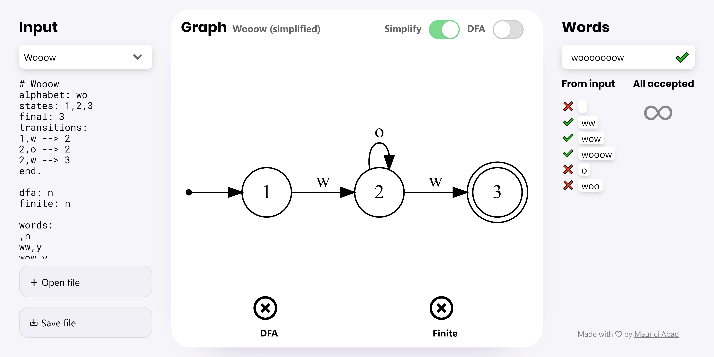

# State Machine | ALE2 Fall 2019 | Maurici Abad

State machine web app by [Maurici Abad Gutierrez](https://mauriciabad.com)

> Use it here: **https://automata-app.netlify.com/**

Main features:

- Open and save files.
- Visualize any DFA, NDA or PDA.
- Evaluate if an arbitrary string is accepted strings.
- Convert a NDA to DFA.
- Evaluate if DFA or NDA is finite.
- List all accepted strings except is they are infinite.
- Accept wrong inputs and fix them automatically.
- Evaluate if an arbitrary string is accepted strings in a PDA.
- Simplify DFA and NDA to a version with fewer nodes and ε.
- Real time processing and really high performance.
- Intuitive, clean and fast UI.



## Assignment 1: parse + dfa

### Parsing

For parsing, I created the `RawGraph` class, that is a regular JavaScript object with all the information from the input structured.

The class has a constructor that accepts a string.

It parses the information using regex and I made them really carefully, so that they accept a very wide variety of errors. When input is unpredictable, a nice message is displayed.

#### Accepted input errors

- It **never crashes** when something is missing or wrong.
- Can skip almost any separation character, specially white spaces spaces and commas.
- The fields `states`, `alphabet` and `stack` are redundant information, so they are extracted from other places. For example:
- If you use a state in `transitions` that's not in `states`, it is added.
- If you have a state in `states` but it not used anywhere else, it doesn't get removed.
- Both examples work for state names, transition letters and stack letters.
- Statements can be in any order.
- In boolean fiends if it's not: `y`, `ye`, `yes`, `true`, `tru`, `tr`, `t`, `1`, `ok` or `si`: it's treated as false.
- Also parses comments.
- In regex, unclosed parenthesis are closes at the end.
- In regex, missing commas are added.
- In regex, consecutive and trailing commas are removed.
- In regex, `.` and `|` operators accept any number of arguments, like: `|(a,b,c,d,e,...)`.
- If input is longer than 5000 characters it's ignored. Avoids freezing the browser.

All this transitions would be accepted:

```
transitions :
  1 ,  a  2 
1, --> 2 
1, ->  2
1 2 3, a -> 1 2 3
1,a [,] ----> 2
1,a [] > 2
1,a [x] - 2
1,_[xy 2
1,[xy2

end.
```

This are the used regex:

```js
const regxParser = {
  comments: /^ *# *(.*) *$/gm,
  regex: /(regex|re|regexr|regular expression)s? *: *(.*)/i,
  alphabet: /alphabets? *: *(\w*)/i,
  stack: /stacks? *: *(\w*)/i,
  states: /states? *: *((.*)*)/i,
  final: /final *: *((.*)*)/i,
  transitions: /transitions? *: *([^]+?) *end\.?/i,
  transition: /^ *([^\n,\->[\]]+) *,? *(\w?) *(\[ *(\w?) *,? *(\w?) *\]?)? *-*>? *([^\n,\->[\]]*)?/gm,
  dfa: /dfa *: *(\w*)/i,
  finite: /finite *: *(\w*)/i,
  words: /words? *: *([^]+?) *end\.?/i,
  word: /^ *(\w*)[^\w\n]+(\w+)/gm,
};
```

### Evaluate if graph is DFA

#### Optimizations

1. My implementation stops whenever the condition can't be satisfied anymore, it doesn't have to keep going until the end.
1. This value is only evaluated the first time you get the value.
1. Use efficient data structures. In this case a Set.

### Code

```js
get isDfa() {
  if (this._isDfa !== undefined) return this._isDfa;
  this._isDfa = this.evalIsDfa();
  return this._isDfa;
}

evalIsDfa() {
  for (const node of this.nodes.values()) {
    const foundLetters = new Set();

    for (const adjacentcy of node.adjacencies) {
      if (foundLetters.has(adjacentcy.label)) return false;
      foundLetters.add(adjacentcy.label);
    }

    if (foundLetters.size !== this.alphabet.size) return false;
  }

  return true;
}
```

### Graph display

I used [Viz.js](http://viz-js.com/), it's a version of [Graph Viz](http://www.graphviz.org/) compiled to Web assembly. It generates asynchronously an svg for any graph.

Because generating the svg can take a relatively long time, I do it asynchronously with a web worker and display a loading spinner while it's processing.

If you input a graph with a lot of edges, it runs out of memory. When that happens, you see the error message, but you can still use all the other functionalities, just without the visualization.

Also, as an optimization. The svg is only computed once and stored in memory, so if you switch the `simplified` toggle on and off really quick, the app is responsive.

#### Errors

- Invalid Input
- Invalid Regex: Missing operator
- Invalid Regex: Parenthesis are wrong
- Invalid Regex: Missing operands
- Invalid Regex: Missing operator
- Missing start node
- Graph too big, skipping drawing (Other functionalities still usable)
- Empty (Other functionalities still usable)

## Assignment 2: accept string

> Cost: **O(n)** where n = number of letters in the word

For every letter and last accessible node, it saves all the possible accessible nodes, making it more efficient when paths diverge and then converge again.

`epsilonAccessibleNodes()` returns all nodes accessible by 0 or any number of silent transitions. It includes the starting node.

### Code

```js
isAcceptedString(word) {
  if (this.isPda) return this.isAcceptedStringPda(word);

  let originNodes = new Set(this.start ? this.start.epsilonAccessibleNodes() : []);

  for (const letter of word) {
    const nextOriginNodes = new Set();

    for (const originNode of originNodes) {
      for (const adjacency of originNode.adjacencies) {
        if (adjacency.label === letter) {
          for (const epsilonAccessibleNode of adjacency.node.epsilonAccessibleNodes()) {
            nextOriginNodes.add(epsilonAccessibleNode);
          }
        }
      }
    }

    if (nextOriginNodes.size === 0) return false;

    originNodes = nextOriginNodes;
  }

  for (const node of originNodes) {
    if (node.isFinal) return true;
  }

  return false;
}
```

Icons meaning:

- ❌: Not accepted.
- ❌ overlapping ✔: Not accepted. But the input file says the opposite.
- ✔: Accepted.
- ✔ overlapping ❌: Accepted. But the input file says the opposite.

There's an input field in the UI where you can test any arbitrary word in real time. Only characters in the automaton alphabet are allowed, otherwise they'll be removed.

## Assignment 3: regular expression

Add `regex: <your regex>` line in the input to use it. Also accepted: `regex`, `re`, `regexr`, `regular expression` and respective plurals.

When `regex:` is present the following fields are ignored:
`alphabet`, `stack`, `states`, `final` and `transitions`.

When a regex graph is generated, the node names are hidden. Except the `Sink` node.

The following input errors are fixed automatically:

- Closes parenthesis if not closed.
- Adds commas in between characters.
- Removes consecutive commas.
- Removes trailing commas.
- Accepts any number of operands in **`.`** and **`|`** operations.
For example: `.(a,b,c,d,e,...)` and `|(a,b,c,d,e,...)`.
- When input is unpredictable a nice message is displayed:
- Invalid Regex: Missing operator
- Invalid Regex: Parenthesis are wrong
- Invalid Regex: Missing operands
- Invalid Regex: Missing operator

Because graphs generated from regexs contain a lot of redundant silent transitions and are more complex than needed, I made a simplify functionality. It's explained in another section.

### Code

```js
const regxParser = {
  regex: /(regex|re|regexr|regular expression)s? *: *(.*)/i,
  // ...
};

class RawGraph {
  constructor(str) {
    // ...
    const regexMatch = str.match(regxParser.regex);

    this.regex = (regexMatch ? regexMatch[2] : '')
      .replace(/[^\w,().*|]+/g, '')         // Remove not accepted characters
      .replace(/(\w)(?=\w)/g, '$1,')        // Add commas to consecutive letters
      .replace(/(\))(?=[\w,(.*|])/g, '$1,') // Add commas to consecutive regex
      .replace(/,+/g, ',')                  // Remove consecutive commas
      .replace(/,\)/g, ')');                // Remove trailing commas

    this.regex += ')'.repeat(Math.max(0, missingParentheses(this.regex.match(/(\(|\))/g) || [])));
    // ...
  }
}
```

```js
class Graph {
  constructor(data, type = 'original') {
    try {
      this.rawData = data;
      this.title = data.comments ? data.comments[0] : 'Graph';
      this.invalid = false;
      this.fromRegex = !!data.regex;
      this.type = type;
      this.isPda = data.stack.length > 0;
      this.stack = data.stack;

      if (this.fromRegex) {
        this.nodes = new Map();
        this.alphabet = new Set();

        try {
          const nodeIn = this.addVertex(undefined);
          const nodeOut = this.addVertex(undefined, true);
          this.start = nodeIn;
          this.addRegex(nodeIn, nodeOut, data.regex);
        } catch (e) {
          this.invalidate(e.message);
        }
      } else {
        // ...
      }
      // ...
    }
  }

  // -------------------------------------- //

  addRegex(nodeIn, nodeOut, regex = ['']) {
    const operator = regex[0];
    if (operator === '(' || operator === ')') throw Error('Invalid regex: \nMissing operator');
    const operands = [];
    let level = 0;
    let operandBegining = 2;
    for (let i = 2; i < regex.length - 1; i += 1) {
      switch (regex[i]) {
        case '(': level += 1; break;
        case ')': level -= 1; break;
        case ',':
          if (level === 0) {
            operands.push(regex.slice(operandBegining, i));
            operandBegining = i + 1;
          }
          break;
        default: break;
      }
    }

    operands.push(regex.slice(operandBegining, regex.length - 1));

    if (level !== 0) throw Error('Invalid regex: \nParenthesis are wrong');

    switch (operator) {
      case '*': this.addRegexRepeat(nodeIn, nodeOut, operands); break;
      case '.': this.addRegexAdd(nodeIn, nodeOut, operands); break;
      case '|': this.addRegexOr(nodeIn, nodeOut, operands); break;
      case '': case undefined: throw Error('Invalid regex: \nMissing operands');
      case '(': case ')': throw Error('Invalid regex: \nMissing operator');
      default: this.addRegexBasic(nodeIn, nodeOut, regex); break;
    }
  }

  // -------------------------------------- //

  addRegexBasic(nodeIn, nodeOut, label) {
    nodeIn.addAdjacency(nodeOut, label);
    this.alphabet.add(label);
  }

  addRegexOr(nodeIn, nodeOut, operands) {
    for (const operand of operands) {
      const nodeIn2 = this.addVertex(undefined);
      const nodeOut2 = this.addVertex(undefined);
      nodeIn.addAdjacency(nodeIn2, '');
      nodeOut2.addAdjacency(nodeOut, '');
      this.addRegex(nodeIn2, nodeOut2, operand);
    }
  }

  addRegexAdd(nodeIn, nodeOut, operands) {
    let lastNode = nodeIn;
    for (const operand of operands) {
      const node = this.addVertex(undefined);
      this.addRegex(lastNode, node, operand);
      lastNode = node;
    }
    lastNode.addAdjacency(nodeOut, '');
  }

  addRegexRepeat(nodeIn, nodeOut, operands) {
    const nodeCenter = this.addVertex(undefined);
    const nodeRight = this.addVertex(undefined);

    nodeIn.addAdjacency(nodeRight, '');
    nodeCenter.addAdjacency(nodeRight, '');
    nodeRight.addAdjacency(nodeIn, '');
    nodeRight.addAdjacency(nodeOut, '');

    this.addRegex(nodeIn, nodeCenter, operands[0]);
  }
  // ...
}
```

## Assignment 4: finite

> Cost: **O(n)** where n = number of nodes accessible from the start node.

To evaluate if a graph is finite it checks if the value has already been evaluated, if not it computes the value.

> **`node.checkIsFinite()`** returns `false` if exists a loop between the node and any final node. Otherwise, it returns `true`. Except if there's any error, it returns `undefined`.

> **`node.nodesInLoop()`** returns a set of nodes that are in a loop accessible from the node.

*To state that a graph is finite you need to check all possible paths ending in a final node, but to state the opposite you only need to find a loop between the start and end.*

So my algorithm traverses recursively the graph in a dfa style. It finds when the graph is not finite (and stopping) or if it has checked all paths it assumes that the graph is finite.

Notice that if there is no accessible final node from the node, the result must be true.

### Code

```js
class Graph {
  // ...
  get isFinite() {
    if (this._isFinite !== undefined) return this._isFinite;
    this._isFinite = this.start.checkIsFinite();
    return this._isFinite;
  }
  // ...
}
```

```js
class Node {
  // ...
  checkIsFinite() {
    try {
      const nodesInLoop = this.nodesInLoop();
      return this.checkIsFiniteRec(nodesInLoop, [], new Set(), [this]);
    } catch (e) {
      // eslint-disable-next-line no-console
      console.error(e);
      return undefined;
    }
  }

  checkIsFiniteRec(nodesInLoop, path, visited, visitNextList) {
    if (visitNextList.length === 0) return true;

    const node = visitNextList.pop();
    path.push(node);

    if (node.isFinal) {
      for (const pathNode of path) {
        if (nodesInLoop.has(pathNode)) return false;
      }
    }

    if (!visited.has(node)) {
      visited.add(node);

      for (const adjacency of node.adjacencies) {
        visitNextList.push(adjacency.node);
        if (!this.checkIsFiniteRec(nodesInLoop, path, visited, visitNextList)) return false;
      }
    }
    path.pop();
    return true;
  }

  // -------------------------------------- //

  nodesInLoop() {
    const loopNodes = new Set();
    this.nodesInLoopRec(loopNodes, [], new Set(), [this]);
    return loopNodes;
  }

  nodesInLoopRec(loopNodes, path, visited, visitNextList) {
    if (visitNextList.length === 0) return;

    const node = visitNextList.pop();
    path.push(node);

    if (visited.has(node)) {
      if (path.includes(node)) {
        for (const loopNode of path.slice(path.indexOf(node) + 1)) {
          loopNodes.add(loopNode);
        }
      }
    } else {
      visited.add(node);

      for (const adjacency of node.adjacencies) {
        visitNextList.push(adjacency.node);
        this.nodesInLoopRec(loopNodes, path, visited, visitNextList);
      }
    }
    path.pop();
  }
  // ...
}
```

## Assignment 5: ndfa

> **`toDfa()`** Replaces the current graph with its dfa equivalent.

I surrounded the function by try in case the new graph becomes too big, it doesn't happen unless you use a really large graph to start with.

listNodes is a Map where the keys are all the node names and the value another Map where the keys are all the letters in the alphabet and the value an empty set.

> **`alphabetAsMap()`** returns a Map where the key is a letter and the value is an empty Set. It fills the map with all the letters of the alphabet of the graph.

> **`addSink()`** just adds a node with the name "Sink" and connects each node with it with all the remaining letters from the alphabet. (look at the code, it's easier to understand)

## Code

```js
class Graph {
  // ...
  toDfa() {
    try {
      const listNodes = new Map([...this.nodes.keys()]
        .map((nodeName) => [nodeName, this.alphabetAsMap()]));

      for (const [nodeName, listLetters] of listNodes) {
        const node = this.nodes.get(nodeName);

        for (const adjacency of node.adjacencies) {
          if (adjacency.label !== '') {
            listLetters.get(adjacency.label).add(adjacency.node.label);
          }
        }

        for (const epsilonAccessibleNode of node.epsilonAccessibleNodes()) {
          if (epsilonAccessibleNode.isFinal) node.isFinal = true;
          for (const adjacency of epsilonAccessibleNode.adjacencies) {
            if (adjacency.label !== '') {
              listLetters.get(adjacency.label).add(adjacency.node.label);
            }
          }
        }
      }

      // Store all information to build a new graph
      const finalNodes = new Set([...this.finalNodes].map((node) => node.label));
      const startNodeName = this.start.label;
      const newNodes = new Set([startNodeName]);

      this.nodes.clear();

      // Build the new dfs graph
      this.start = this.addVertex(startNodeName);

      for (const composedNodeName of newNodes) {
        const composedNodeNameContainsFinalNode = composedNodeName.split(',').reduce((total, node2) => total || finalNodes.has(node2), false);
        if (composedNodeNameContainsFinalNode) {
          this.addVertex(composedNodeName).isFinal = true;
        }

        const listNodes2 = this.alphabetAsMap();

        for (const nodeName of composedNodeName.split(',')) {
          for (const [letter, accesibleNodes] of listNodes.get(nodeName)) {
            for (const node2 of accesibleNodes) {
              listNodes2.get(letter).add(node2);
            }
          }
        }

        for (const [letter, accesibleNodes] of listNodes2) {
          if (accesibleNodes.size !== 0) {
            const newNodeName = [...accesibleNodes].join(',');

            newNodes.add(newNodeName);

            this.addEdge(composedNodeName, newNodeName, letter);
          }
        }
      }

      this.addSink();
    } catch (e) {
      // eslint-disable-next-line no-console
      console.error(e);
      this.invalidate('Error converting to DFA');
    }
  }

  addSink() {
    for (const node of this.nodes.values()) {
      for (const letter of this.alphabet) {
        if (!node.isAdjecent({ label: letter })) this.addEdge(node.label, 'Sink', letter);
      }
    }
  }

  alphabetAsMap() {
    return new Map([...this.alphabet].map((letter) => [letter, new Set()]));
  }
  // ...
}
```

## Assignment 6: pda

With PDA there are some functionalities that can't be used:

- Check if it's finite
- Check if it's DFA
- List all accepted words
- Convert to DFA
- Simplify

In the UI you can see that they are disabled.

The software detects when a graph is a pda, the user don't have to specify.
When the number of letters in the stack is greater than 0, it is a pda. The stack line can be omitted.
The following transition are totally equivalent:
```
1,a [_,_] --> 2
1,a --> 2
```

> **`isAcceptedStringPda()`** Returns true if the _word_ is accepted in a pda graph. False otherwise. The code is almost the same as `epsilonAccessibleNodesPda()` but with some additions.

> **`epsilonAccessibleNodesPda()`** Returns a Map where the keys are all the nodes accessible by epsilon transitions and the values are a Set containing all the possible stacks that you can have from that node. _Because sometimes there are infinite stacks, the stacks with more than 1000 letters are discarded._

The algorithm is similar to the one used in `isAcceptedString()`.
The main difference is that this algorithm also keeps track of the possible stacks that you can have in every step. And once all letters are used it checks if there's any final node with an empty stack.

If at some point there are no more nodes reachable, the function returns false immediately.

```js
class Graph{
  // ...
  isAcceptedStringPda(word) {
    let originNodeStacks = this.start.epsilonAccessibleNodesPda();

    for (const letter of word) {
      const nextOriginNodeStacks = new Map();

      for (const [node, stacks] of originNodeStacks) {
        for (const stack of stacks) {
          const pop = stack.slice(-1);

          for (const adjacency of node.adjacencies) {
            if (adjacency.label === letter && (adjacency.stackPop === '' || adjacency.stackPop === pop)) {
              if (stack.length <= 1000) {
                const nextStack = ((adjacency.stackPop === '') ? stack : stack.slice(0, -1)) + adjacency.stackPush;
                const epsilonAccessibleNodes = adjacency.node.epsilonAccessibleNodesPda(nextStack);

                for (const [node2, stacks2] of epsilonAccessibleNodes) {
                  if (!nextOriginNodeStacks.has(node2)) nextOriginNodeStacks.set(node2, new Set());
                  nextOriginNodeStacks.get(node2).add(...stacks2);
                }
              }
            }
          }
        }
      }

      if (nextOriginNodeStacks.size === 0) return false;

      originNodeStacks = nextOriginNodeStacks;
    }

    for (const [node, stacks] of originNodeStacks) {
      for (const stack of stacks) {
        if (node.isFinal && stack === '') return true;
      }
    }

    return false;
  }
  // ...
}
```

```js
class Node {
  // ...
  epsilonAccessibleNodesPdaRec(nodeStacks = new Map([[this, new Set([''])]])) {
    for (const [node, stacks] of nodeStacks) {
      for (const stack of stacks) {
        const pop = stack.length >= 1 ? stack.slice(-1) : undefined;

        for (const adjacency of node.adjacencies) {
          if (adjacency.label === '' && (adjacency.stackPop === '' || (pop && adjacency.stackPop === pop))) {
            if (stack.length <= 1000) {
              let newStack = adjacency.stackPop === pop ? stack.slice(0, -1) : stack;
              newStack += adjacency.stackPush;
              if (!nodeStacks.has(adjacency.node)) nodeStacks.set(adjacency.node, new Set());
              if (!nodeStacks.get(adjacency.node).has(newStack)) {
                nodeStacks.get(adjacency.node).add(newStack);
                const nextNodeStacks = adjacency.node.epsilonAccessibleNodesPdaRec(nodeStacks);

                // Add nextNodeStacks to nodeStacks
                for (const [node2, stacks2] of nextNodeStacks) {
                  if (!nodeStacks.has(node2)) nodeStacks.set(node2, new Set());
                  nodeStacks.get(node2).add(...stacks2);
                }
              }
            }
          }
        }
      }
    }

    return nodeStacks;
  }

  epsilonAccessibleNodesPda(stack = '') {
    return this.epsilonAccessibleNodesPdaRec(new Map([[this, new Set([stack || ''])]]));
  }
  // ...
}
```

## UI

UI files:

- Layout: [/src/index.html](/src/index.html)
- Style: [/src/stylesheets/main.css](/src/stylesheets/main.css)
- Script: [/src/javascripts/scripts.js](/src/javascripts/scripts.js)
- Tests: [/src/data/templates.json](/src/data/templates.json)
- Images: [/src/images/](/src/images/)

This are some features implemented in the UI:

- Input changes are displayed immediately and there are no unnecessary buttons.
- If the user changes the input, but the information is the same, the app doesn't evaluate everything again. For example, entering a new empty line won't make the app check if the graph is dfs, finite, check the words, etc.
- Uses a minimalistic design in which the main content is the graph visualization.
- Uses different typographies (title, content and code)
- Has good contrast in text color.
- Works in Chrome, Firefox, Safari and Edge.
- Works the best with Chrome.
- The app is usable 100% only with the keyboard.
- The graph visualization has a loading animation because sometimes it takes some time to generate.
- Once a graph visualization is generated, it's stored in a local variable. This way if the user switches fast the toggles the app will show instantly the new visualization.
- The input is stored in `localStorage` between sessions. So users never lose their work.
- The first comment of a graph input is considered it's title.
- When you download the input as a file:
- The app formats it (applies fixes and adds omitted lines).
- It has a relevant file name.
- Displays error messages instead of crashing.
- When the input states that the graph is dfa, final or a word is accepted. The UI checks if it's right, if it's not right is shows visual hints to indicate that. If information is not specified in the input, the ui is the same as if it was right.
- Files can be opened:
- Can also be dragged and dropped into the button.

## Testing

The app has over 50 different input tests. They try edge cases and happy paths.

To ensure high quality code this project has [ESLint](https://eslint.org/) configured with the recommended settings. ESLint is a great code analysis tool for JavaScript.

### Continuous Integration

The project also has Continuous Integration configured in [GitHub](https://github.com/) with [Travis](https://travis-ci.org/) and [Netlify](https://www.netlify.com/).

Every commit triggers a build in Travis and Netlify.

> Travis runs ESLint and doesn't let you merge failing branches.

> Netlify builds the site and deploys it to https://automata-app.netlify.com/ 100% automatically and free. This makes me forget about deploying the app, it's always up-to-date.

## Other contributions

### Tools

I used several tools/technologies/libraries to make a better project:

- [GitHub](https://github.com/) to manage the project
- [Webpack](https://webpack.js.org/) to optimize the files
- [Static Site Boilerplate](http://staticsiteboilerplate.com/) as a boilerplate
- [ESLint](https://eslint.org/) to test the code
- [Travis](https://travis-ci.org/) to run tests
- [Netlify](https://www.netlify.com/) to deploy
- [Web Workers](https://web.dev/off-main-thread/) for asynchronous code
- [Viz.js](http://viz-js.com/) to use [Graphviz](http://www.graphviz.org/) in the browser
- [PostCSS](https://postcss.org/) to compile css files
- [Node.js](https://nodejs.org/) and [npm](https://www.npmjs.com/) to run builds
- JavaScript

I spent time learning most of these things.

### Autofix input errors

As explained in previous sections, the input is automatically fixed most of the cases.

### Beautiful, Simple and Accessible UI

I spent a lot of time tweaking all kind of details in the UI to make it the most beautiful, simple and accessible possible.

### Simplify functionality

I made a function that removes all epsilon transitions in a graph to make the regex graphs more readable. It produces an equivalent automaton.

```js
class Graph {
  // ...
  simplify() {
    if (!this.isPda) {
      this.simplifyConsecutiveEpsilons();
      this.simplifyEpsilonLoops();
      this.simplifyStart();
      this.simplifySkipableNodes();
      this.simplifySelfEpsilonLoops();
      this.simplifyEpsilonToFinal();
      this.simplifyPowersetAlgorithm();
    }
  }

  simplifyEpsilonLoops() {
    const nodesOrigins = this.nodesOrigins();

    for (const loop of this.start.epsilonLoops()) {
      const firstNode = Array.from(loop).reduce(
        (oldNode, node) => (node === this.start ? node : oldNode),
        Array.from(loop)[0],
      );

      for (const node of loop) {
        if (node !== firstNode) {
          for (const adjecency of node.adjacencies) {
            if (adjecency.node.isFinal && adjecency.label === '') firstNode.isFinal = true;

            firstNode.addAdjacency(adjecency.node, adjecency.label);
          }
          for (const originNode of nodesOrigins.get(node).values()) {
            for (const originNodeAdjecency of originNode.adjacencies) {
              if (node === originNodeAdjecency.node) {
                if (originNodeAdjecency.label !== '') {
                  originNode.addAdjacency(firstNode, originNodeAdjecency.label);
                }
              }
            }
          }
          this.removeVertex(node.label);
        }
      }
      if (firstNode && firstNode.hasAdjacency(firstNode, '')) firstNode.removeAdjacency(firstNode, '');
    }
  }

  simplifyConsecutiveEpsilons() {
    const undeletableEpsilonNodes = new Set([this.start]);
    const nodesOrigins = this.nodesOrigins();

    for (const node of this.nodes.values()) {
      for (const adjecency of node.adjacencies) {
        if (adjecency.label !== '') {
          undeletableEpsilonNodes.add(node);
          undeletableEpsilonNodes.add(adjecency.node);
        }
      }
    }

    for (const node of this.nodes.values()) {
      if (!undeletableEpsilonNodes.has(node)) {
        for (const adjecency of node.adjacencies) {
          const destinationNode = adjecency.node;
          if (node.isFinal) destinationNode.isFinal = true;

          for (const originNode of nodesOrigins.get(node).values()) {
            if (originNode !== destinationNode) {
              originNode.addAdjacency(destinationNode, '');
              nodesOrigins.get(destinationNode).add(originNode);
            }
          }
        }
        if (node.adjacencies.length === 0 && nodesOrigins.has(node)) {
          for (const originNode of nodesOrigins.get(node).values()) {
            originNode.isFinal = node.isFinal;
          }
        }

        this.removeVertex(node.label);
        node.isFinal = true;
      }
    }
  }

  simplifySkipableNodes() {
    const nodesOrigins = this.nodesOrigins();

    for (const node of this.nodes.values()) {
      if (node !== this.start && !node.isFinal && node.adjacencies.length !== 0) {
        let skipable = true;
        for (const adjecency of node.adjacencies) {
          if (adjecency.label !== '') {
            skipable = false;
            break;
          }
        }
        if (skipable) {
          for (const originNode of nodesOrigins.get(node).values()) {
            for (const originNodeAdjecency of originNode.adjacencies) {
              if (originNodeAdjecency.node === node) {
                for (const destinationNode of node.adjecentNodes) {
                  originNode.addAdjacency(destinationNode, originNodeAdjecency.label);
                }
              }
            }
          }
          this.removeVertex(node.label);
        }
      }
    }
  }

  simplifyStart() {
    const nodesOrigins = this.nodesOrigins();

    for (const startAdjecency of this.start.adjacencies) {
      const { node } = startAdjecency;
      if (node !== this.start) {
        let skipable = nodesOrigins.get(node).size === 1;
        if (skipable) {
          for (const adj of [...nodesOrigins.get(node)][0].adjacencies) {
            if (adj.node === node && adj.label !== '') {
              skipable = false;
              break;
            }
          }
        }

        if (skipable && startAdjecency.label === '') {
          for (const adjecency of node.adjacencies) {
            this.start.addAdjacency(adjecency.node, adjecency.label);
          }
          if (node.isFinal) this.start.isFinal = true;
          this.removeVertex(node.label);
        }
      }
    }
  }

  simplifySelfEpsilonLoops() {
    for (const node of this.nodes.values()) {
      node.removeAdjacency(node, '');
    }
  }

  simplifyPowersetAlgorithm() {
    for (const node of this.nodes.values()) {
      for (const accesibleNode of node.epsilonAccessibleNodes()) {
        if (accesibleNode.isFinal) node.isFinal = true;
        for (const accesibleNodeAdjacency of accesibleNode.adjacencies) {
          if (accesibleNodeAdjacency.label !== '') node.addAdjacency(accesibleNodeAdjacency.node, accesibleNodeAdjacency.label);
        }
      }
      for (const adjacency of node.adjacencies) {
        if (adjacency.label === '') node.removeAdjacency(adjacency.node, adjacency.label);
      }
    }
  }

  simplifyEpsilonToFinal() {
    for (const node of this.nodes.values()) {
      for (const accesibleNode of node.epsilonAccessibleNodes()) {
        if (node !== accesibleNode && accesibleNode.isFinal) {
          node.isFinal = true;
          if (accesibleNode.adjacencies.length === 0) node.removeAdjacency(accesibleNode, '');
        }
      }
    }
  }

  nodesOrigins() {
    const nodesOrigins = new Map();

    for (const node of this.nodes.values()) {
      nodesOrigins.set(node, new Set());
    }

    for (const node of this.nodes.values()) {
      for (const adjecency of node.adjacencies) {
        nodesOrigins.get(adjecency.node).add(node);
      }
    }
    return nodesOrigins;
  }
  // ...
}
```
